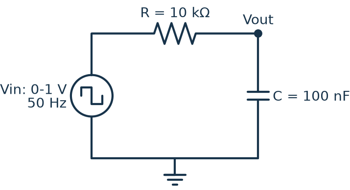
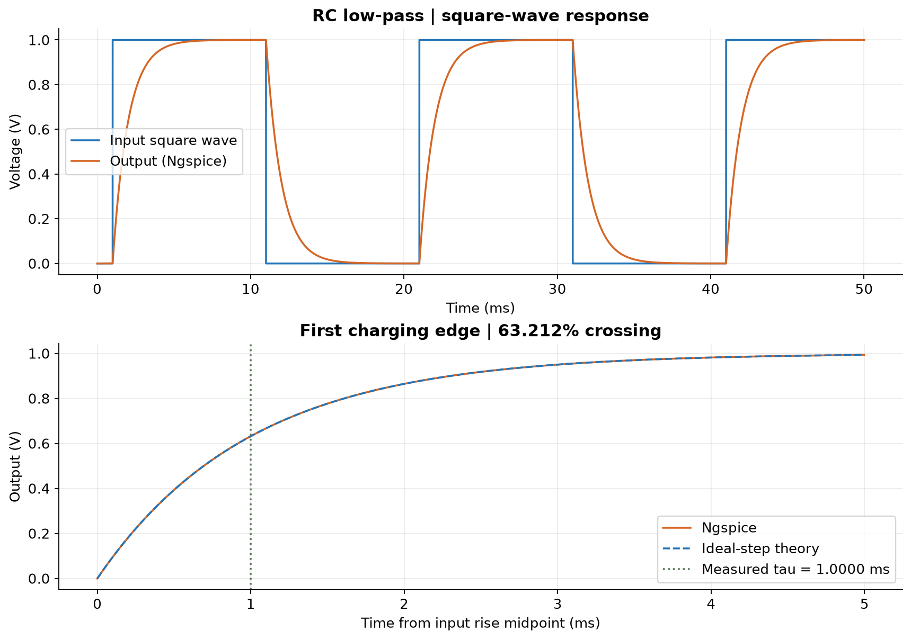
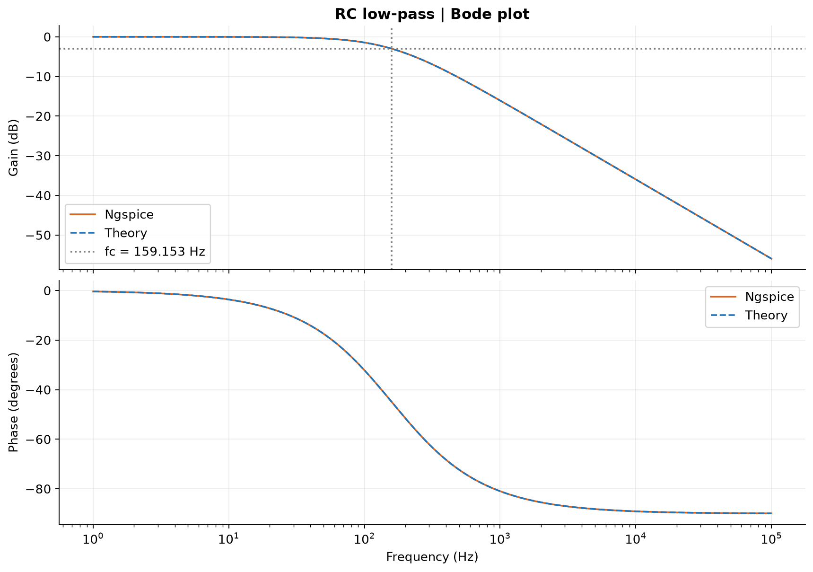
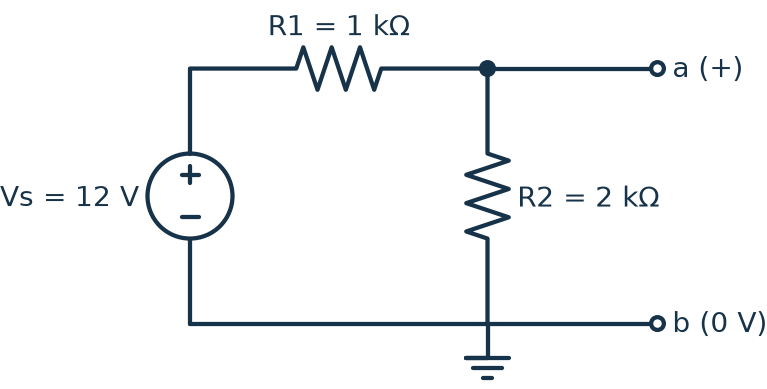
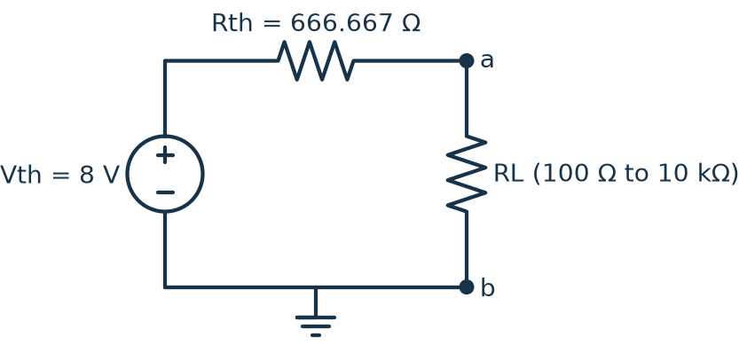
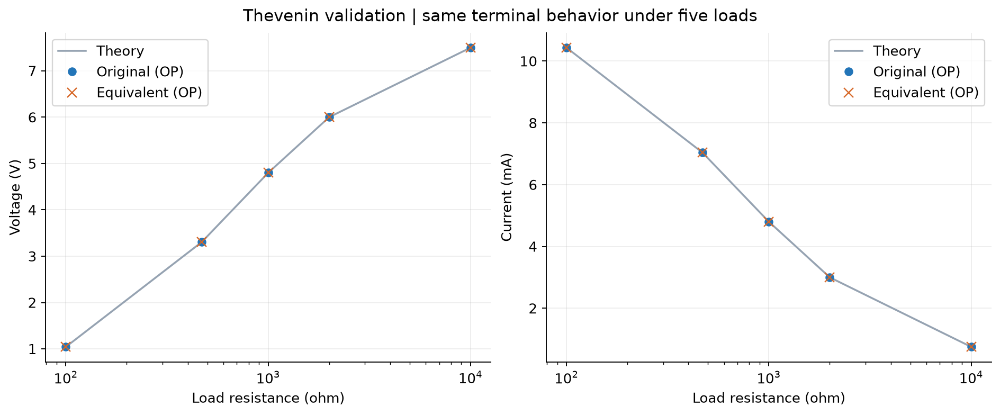
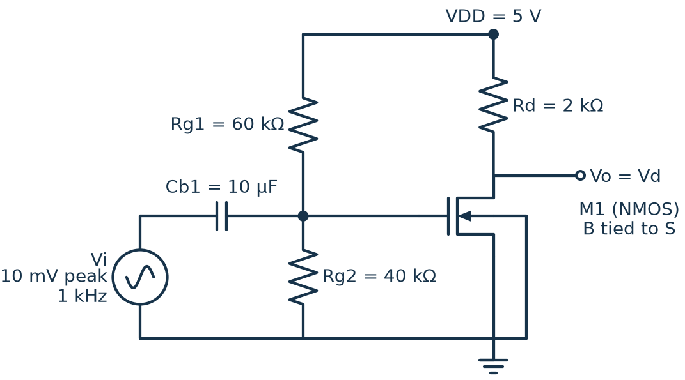
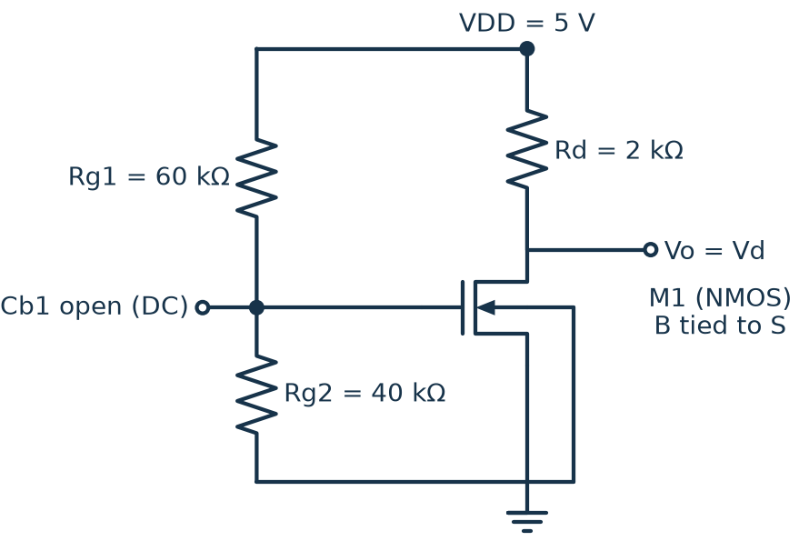
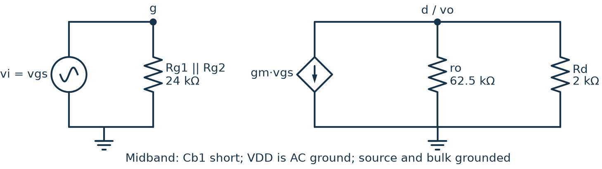
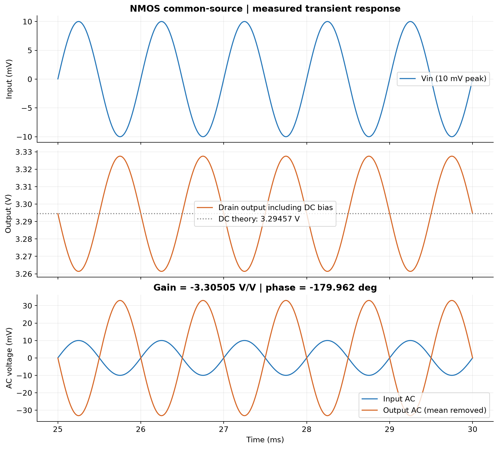

# 大一招新考核

**个人网站： [https://andy-bit-sys.github.io/kaohe/](https://andy-bit-sys.github.io/kaohe/)**

**贪吃蛇： [打开游戏](https://andy-bit-sys.github.io/kaohe/snake.html)**

**进阶挑战 1：[PySpice 三个电路的计算与仿真](#circuits)**

本仓库用于逐步完成协会招新考核，保存个人网站、个人简介 PDF、小游戏、进阶项目及开发记录。

## 当前进度

- [x] 准备 Git、VS Code 和 AI 编程工具 Codex
- [x] 登录 GitHub
- [x] 完成个人简介 PDF
- [x] 完成个人网站
- [x] 完成小游戏的手动操作和 AI 自动演示
- [x] 完成进阶挑战 1 的三个电路代码、图表和仿真验证
- [ ] 本人复核电路图、计算过程，并能独立讲解三个电路
- [x] 补齐验证结果、提示词迭代记录和两处代码逻辑说明草稿
- [x] 添加 MIT LICENSE 并说明选择原因
- [x] 保存真实 AI 代码错误的复现程序、依据与修复过程
- [ ] 本人复现查错过程，并用自己的话确认两处代码逻辑说明
- [ ] 确认 GitHub 两步验证已开启
- [ ] 截止前将仓库链接提交至群内收集表

逐项状态和验收入口：[考核核对表](docs/acceptance.md)。

## 开发记录

### 环境准备

- Git：2.53.0.windows.3
- VS Code：1.136.1
- AI 编程工具：Codex
- 本次使用 Codex 检查开发环境并初始化仓库；后续实现与验证过程会随开发进度记录。

### 个人简介 PDF

- 已完成：[刘锦桉的个人简介（详细版）](output/pdf/刘锦桉_个人简介_详细版.pdf)。
- 内容涵盖个人背景、项目兴趣、足球爱好和大学期待，采用一页蓝白排版。
- 补齐可点击的 GitHub 联系入口；生成代码见 [create_profile.py](scripts/create_profile.py)。Windows 下安装 `reportlab`、`pdfplumber`、`pypdfium2` 后运行 `python scripts/create_profile.py`，使用系统微软雅黑字体。
- 验证：检查 PDF 为单页，核对姓名、籍贯、年级班级，并渲染检查中文显示和排版。

### 个人网站

- 页面代码：[index.html](index.html)，使用原生 HTML/CSS，无需安装框架或运行构建命令。
- 本地预览：双击 `index.html`；下载个人简介时需保留 `output/pdf/` 目录。
- 内容：自我介绍、兴趣爱好、大学期待、个人简介 PDF 下载与 GitHub 入口。
- 验证：使用浏览器检查桌面、390px 和 320px 手机宽度；检查导航跳转、PDF 文件路径和页面错误。
- 在线访问：[刘锦桉的个人主页](https://andy-bit-sys.github.io/kaohe/)。
- GitHub Pages 从 `main` 分支根目录发布；修改并推送网站文件后会自动更新。
- AI 协作：本人提供资料、提出扩写和删除要求并审阅简介；Codex 协助写作、PDF 排版及 HTML/CSS 实现。个人资料未添加未经提供的经历或成绩。

### 贪吃蛇小游戏

文件：[snake.html](snake.html)。游戏的 HTML、CSS、JavaScript 都在这一个文件中，没有外部脚本、字体、图片或框架依赖。下载这个文件后，双击即可用浏览器运行；页面中的个人主页和仓库链接属于可选导航，不影响独立游戏。

#### 阶段一：手动操作

- 操作：点击“手动新局”，使用方向键或 WASD 转向；手机支持方向按钮、棋盘滑动。空格或暂停按钮用于暂停与继续。手动默认每秒 2 步，也可选择每秒 4 或 6 步，调整即时生效。
- 规则：12 × 12 棋盘，初始长度为 4；每吃一个食物加 10 分、增长一格；食物只生成在空格。撞墙或撞到身体结束，填满 144 格获胜。
- 实现：用坐标数组保存蛇身，按固定时间间隔推进；每步最多接受一次有效转向，禁止立即反向。切换新局会重置本局分数和进度；隐藏页面时自动暂停。
- 视觉：使用 Canvas 中的原生 WebGL 绘制三维蛇与森林场景。球体、圆柱体组成蛇身、眼睛和装饰物，带透视和光照；头部随方向转动，带腮红和间歇出现的蛇信子。初版二维造型已在后续迭代中替换，没有外部图片或框架依赖。
- 验证：自动测试覆盖移动、增长、反向输入、撞墙、自撞、进入刚移走的尾格、暂停和重新开局；浏览器检查键盘、按钮、滑动与手机布局。

#### 阶段二：AI 自动演示

- 点击“AI 自动新局”后，程序自行转向和吃食物，屏幕显示食物数、分数、步数和 15 个食物的挑战进度；达标后继续运行，直到填满棋盘。
- AI 使用规则算法，不调用在线大模型。它先用 BFS 搜索通往食物的较短路线，再模拟吃到食物后的蛇身；只有蛇头仍能找到蛇尾，而且捷径不会越过蛇尾时才采用。检查不通过就沿覆盖全棋盘的闭合路线继续巡航。
- 选择这一方案的原因：BFS 让蛇主动靠近食物，闭合路线提供安全退路。安全检查会放弃可能把自己围住的最短路，因此某些食物仍会绕行，但比始终沿固定路线更快。
- 验证：1000 组不同种子的随机食物序列全部达到连续 15 个食物，所需步数为 138 至 675，平均 312 步；相同序列只走固定闭合路线平均需要 1003 步。另有 20 组运行至填满棋盘，全部吃到 140 个食物并获胜。浏览器还使用正常计时和随机食物完成了自动连续吃到至少 15 个的实测。
- 复核方法：AI 默认每秒 8 步，方便观察，也可切换到每秒 20 或 45 步。点击“AI 自动新局”，保持页面可见且不操作，观察挑战进度变为“15 个挑战已达标”。

#### 新增功能：主题切换与多局战绩

提供深色和浅色两套配色，点击右上角按钮即时切换，通过 `localStorage` 保存选择；已验证刷新后保留。若浏览器禁用存储，页面会提示，游戏仍可运行。当前额外功能按“主题切换”验收，本局得分不作为“持久计分制”功能申报。

最近战绩会记录游戏模式、结果、得分、食物数、步数和时间。游戏结束时立即记录；进行中的游戏被“新局”替换时，自动以“重新开局”记录。数据通过 `localStorage` 保存，只保留最新 10 局；页面默认显示最近 3 局，点击“查看全部”可查看完整列表，也可确认后清空。已验证新增、结束、10 局上限、展开、刷新保留和清空功能。

#### 关键逻辑学习说明

以下说明用于对照代码理解，提交前需要本人能用自己的话讲清楚。

1. **蛇为什么会移动和变长？** `tick()` 先根据方向算出新蛇头，把它加到数组前面；没有吃到食物时删掉最后一节，所以总长度不变，看起来整条蛇向前移动。吃到食物时保留尾巴，因此长度增加一格。判断碰撞时，没吃到食物的那一步允许进入即将移走的尾格。
2. **AI 怎样追踪食物又避免死路？** BFS 从蛇头开始一层层检查可以到达的格子，先找到步数较少的食物路线。程序不会直接照着走，而是先复制蛇身并模拟整条路线；吃到食物后，如果蛇头还能绕到蛇尾，且捷径没有越过蛇尾，才真正迈出第一步。否则就沿预先准备的闭合路线走一步，下次再重新搜索。

#### 提示词与实际迭代

| 关键输入原文 | 希望 AI 做什么 | 实际结果与调整 |
| --- | --- | --- |
| “贪吃蛇吧” | 从考核的三种游戏中选择贪吃蛇 | 结合任务书中的手动、AI 连吃 15 个和单文件要求制作初版，新增功能选择主题切换。 |
| “我有godot引擎，用这个‘” | 希望使用已有的 Godot 引擎 | 核对后发现常规 Godot 导出不符合任务书的单 HTML、无框架要求，说明差异后暂缓变更。 |
| “继续按考核要求做 吧” | 按任务书格式继续完成游戏 | 保留 HTML 方案，补充规则测试、真实浏览器演示、手机操作和主页入口。 |
| “太快了” | 降低游戏速度，方便操作和观察 | 手动默认改为每秒 4 步，AI 默认改为每秒 8 步；增加手动速度选择，两种模式均支持三档速度。 |
| “还是快，两步每秒吧” | 进一步降低手动速度 | 手动默认改为每秒 2 步，另外保留每秒 4 和 6 步两档。 |
| “你做的贪吃蛇ai演示，怎么是穷举法？不能智能追踪食物吗” | 让 AI 主动追踪食物 | 将固定巡航改为 BFS 追踪、安全局面模拟和闭合路线回退的混合算法。第一版只限制“不越过蛇尾”，测试时出现反复绕行；增加“不能跳过食物”和吃后逃生检查后重新验证。 |
| “那就这样” | 确认使用智能追踪方案 | 完成混合算法并扩大随机测试规模，同时对比固定巡航的平均步数。 |
| “多局战绩 记录最近 10 局结果；新一局自动追加；可查看完整列表” | 增加任务书中的多局战绩功能 | 保存结束或被新局替换的游戏，最多保留 10 局；默认显示最近 3 局，可展开完整列表并清空。 |
| “你能不能为蛇建模？”、“来个可爱一点的” | 让蛇成为可爱的三维模型 | 初版误做成 Canvas 2D 造型；确认需求后改用原生 WebGL 建立球体、圆柱连接段和立体棋盘，加入透视、光照、阴影、大眼睛、腮红及蛇信子，仍保持单文件。 |
| “把地图也改改，改可爱一点，可以放点3d建模的物品”、“装饰品丰富一点” | 让游戏环境与三维蛇的风格一致 | 将平面棋盘扩展成 3D 森林乐园，加入交错草坪格、草地底座、树木、蘑菇、花丛、石头、浆果灌木、池塘、长椅、路灯、鸟屋、蝴蝶、云朵和矮栅栏；装饰位于可行走区域外，不改变碰撞规则。 |

调试中发现：点击新局后，按钮持有焦点，空格可能触发再次开局。修复方式是开始、转向和暂停后把焦点交给棋盘，并验证空格能暂停且不清零。另将手动新局起点移到棋盘中部，方便初次操作；修正获胜后的提示，手机开局后自动显示棋盘。

AI 协作：游戏代码、测试和本节初稿由 Codex 生成并调试；本人选择游戏与开发方式，代码逻辑说明需要本人理解后确认。

规则测试文件：[tests/snake.test.cjs](tests/snake.test.cjs)。安装 Node.js 后，在仓库目录运行 `node tests/snake.test.cjs`；测试直接读取 HTML 中的同一份游戏逻辑，运行游戏本身不需要 Node.js。浏览器与战绩检查程序也已提交，[复核命令见这里](tests/README.md)。

<a id="circuits"></a>

### 进阶挑战 1：PySpice 三个电路

**实现状态：三个电路已用 PySpice 1.5 调用 Ngspice 34 实际运行通过。** 本节记录 2026-09-06 在 Windows、Python 3.12.14 环境中的结果。理论曲线与仿真数据分别计算；仿真数据来自 Ngspice 求解。这里的“实测增益”指从仿真波形测量，没有进行硬件搭建或示波器测量。

三个实验脚本：[rc_filter.py](circuits/rc_filter.py)、[thevenin.py](circuits/thevenin.py)、[mos_amplifier.py](circuits/mos_amplifier.py)。另有公共辅助文件 [common.py](circuits/common.py)，负责输出图表、版本记录和数值核验，运行时请一起保留。电路图由 Schemdraw 根据脚本绘制，保存 PNG 和可编辑的 SVG；[results 目录](circuits/results) 同时包含 CSV 原始数值、JSON 对比结果和可复用的 SPICE 网表。

**AI 协作说明：** 用户选择挑战 1 并明确要求使用 PySpice。实验代码、电路图绘制代码、理论推导及本节初稿由 Codex 编写、运行和核对；尚未把它们记作本人独立手绘、手算或已掌握的内容。本人需依据考核要求复核图与计算，并能用自己的话讲清楚原理。

#### 如何运行

下载整个仓库，保留 `circuits` 文件夹。在仓库根目录打开 PowerShell。当前电脑的独立环境已配置好，可直接运行：

```powershell
.\.venv-circuits\Scripts\python.exe circuits/rc_filter.py
.\.venv-circuits\Scripts\python.exe circuits/thevenin.py
.\.venv-circuits\Scripts\python.exe circuits/mos_amplifier.py
```

在另一台 Windows 电脑上，先安装 64 位 Python 3.12，然后创建环境（环境和 DLL 没有上传仓库）：

```powershell
python -m venv .venv-circuits
.\.venv-circuits\Scripts\python.exe -m pip install -r circuits/requirements.txt
.\.venv-circuits\Scripts\pyspice-post-installation.exe --install-ngspice-dll
```

运行后图表与数据生成在 `circuits/results/`，终端打印理论值、仿真值、误差和 `passed: true`。若数值偏离设定容差或 MOS 离开饱和区，程序会报错。CSV 单位写在列名中；JSON 记录仿真器版本。首次安装需要联网，安装完成后这三个实验可离线运行。

#### ① RC 低通滤波电路

参数自选：R = 10 kΩ，C = 100 nF。输入为 0～1 V、50 Hz 方波，上升和下降时间各 1 µs，输出从电容两端取出。没有外接负载。



**理论计算：** 电容阻抗为 $Z_C=1/(j\omega C)$，按分压可得：

$$
H(j\omega)=\frac{Z_C}{R+Z_C}=\frac{1}{1+j\omega RC}
$$

$$
\tau=RC=10^4\times100\times10^{-9}=0.001\ \mathrm{s}=1\ \mathrm{ms}
$$

$$
f_c=\frac{1}{2\pi RC}=159.154943\ \mathrm{Hz}
$$

在 $f_c$ 处，幅值为 $1/\sqrt2$，即 −3.0103 dB，相位为 −45°。初始电压为 0、输入理想阶跃为 1 V 时，$v_o(t)=1-e^{-t/\tau}$；经过一个时间常数上升至最终值的 63.212%。

**怎样验证：** 瞬态仿真覆盖 0～50 ms，最大步长 10 µs。用第一次上升沿的 63.212% 交点测量 τ，以输入 1 µs 上升沿的中点作为时间基准。交流扫描覆盖 1 Hz～100 kHz，每十倍频程 200 点；在幅频曲线上插值寻找 −3.0103 dB 交点。截止频率与 τ 均从仿真数据提取。

| 量 | 理论值 | 仿真值 | 相对误差 |
| --- | ---: | ---: | ---: |
| τ / ms | 1.000000 | 1.000002 | 0.000208% |
| fc / Hz | 159.154943 | 159.152505 | 0.001532% |





**结果解释：** 电容电压随充放电逐渐变化，方波的突变边缘被平滑。频率升高时电容阻抗减小，更多信号电压落在串联电阻上，电容两端输出幅度变小。图上的理论线与仿真线基本重合；微小误差来自有限上升时间、仿真步长和交点插值。

原始资料：[瞬态 CSV](circuits/results/rc_transient.csv)、[交流 CSV](circuits/results/rc_ac.csv)、[完整对比 JSON](circuits/results/rc_results.json)。

#### ② 戴维南定理验证

参数自选：Vs = 12 V，R1 = 1 kΩ，R2 = 2 kΩ。端口 a 在两电阻连接处，端口 b 为地。负载接在 a、b 之间；短路电流正方向定义为从 a 流向 b。



**理论计算：** 开路时，R1 与 R2 构成分压：

$$
V_{oc}=V_{th}=12\times\frac{2000}{1000+2000}=8\ \mathrm{V}
$$

求等效电阻时，将理想独立电压源置零（短路），此时从 a、b 看进去 R1、R2 并联：

$$
R_{th}=R_1\parallel R_2=\frac{1000\times2000}{1000+2000}=666.666667\ \Omega
$$

端口短路时 R2 两端电压为零，R1 电流全部流过短路线：

$$
I_{sc}=\frac{12}{1000}=12\ \mathrm{mA},\qquad \frac{V_{oc}}{I_{sc}}=\frac{8}{0.012}=666.666667\ \Omega
$$

**怎样验证：** PySpice 分别构建开路和短路电路，各运行一次 OP（直流工作点）仿真。短路使用一个 0 V 电压源作为理想电流表，从它的支路读取 $I_{sc}$。

| 量 | 理论值 | 仿真值 | 相对误差 |
| --- | ---: | ---: | ---: |
| Voc / V | 8.000000 | 8.000000 | <0.000001% |
| Isc / mA | 12.000000 | 12.000000 | <0.000001% |
| Rth / Ω | 666.666667 | 666.666667（Voc/Isc） | <0.000001% |

再用 8 V 电压源串联 666.666667 Ω 替换原网络。对五种负载，分别构建“原网络加负载”和“等效网络加负载”，独立运行 OP。



$$
V_L=\frac{V_{th}R_L}{R_{th}+R_L},\qquad I_L=\frac{V_{th}}{R_{th}+R_L}=\frac{V_L}{R_L}
$$

例如 RL = 1 kΩ 时，$V_L=8\times1000/(666.666667+1000)=4.8\ \mathrm{V}$，$I_L=4.8\ \mathrm{mA}$。

| RL / Ω | 理论 VL / V | 原网络 VL / V | 等效网络 VL / V | 理论 IL / mA | 原网络 IL / mA | 等效网络 IL / mA |
| ---: | ---: | ---: | ---: | ---: | ---: | ---: |
| 100 | 1.043478 | 1.043478 | 1.043478 | 10.434783 | 10.434783 | 10.434783 |
| 470 | 3.307918 | 3.307918 | 3.307918 | 7.038123 | 7.038123 | 7.038123 |
| 1000 | 4.800000 | 4.800000 | 4.800000 | 4.800000 | 4.800000 | 4.800000 |
| 2000 | 6.000000 | 6.000000 | 6.000000 | 3.000000 | 3.000000 | 3.000000 |
| 10000 | 7.500000 | 7.500000 | 7.500000 | 0.750000 | 0.750000 | 0.750000 |



**结果解释：** 在相同负载下，两个网络的端口电压和负载电流一致，验证了端口对外的等效性。它不表示两个网络内部的每个支路电流或功耗都相同。这里采用理想线性元件，所以误差接近数值精度。

原始资料：[五组负载 CSV](circuits/results/thevenin_loads.csv)、[OP 与负载完整结果 JSON](circuits/results/thevenin_results.json)、[开路网表](circuits/results/thevenin_open.cir)、[短路网表](circuits/results/thevenin_short.cir)。

#### ③ NMOS 共源级放大电路

按题卡连接：VDD = 5 V，Rg1 = 60 kΩ，Rg2 = 40 kΩ，Rd = 2 kΩ；源极 S 和衬底 B 接地，漏极为输出，无额外负载。输入 10 mV 按**峰值**解释，频率为 1 kHz；取 Cb1 = 10 µF 实现题目的“足够大”。



**K 的约定：** 题卡给 K = 0.8 mA/V²、阈值电压 1 V、λ = 0.02/V，但没有写出含 K 的电流公式。本报告明确采用下式，不把不同教材的 K 定义混用：

$$
I_D=K(V_{GS}-V_{TH})^2(1+\lambda V_{DS})
$$

Ngspice 的 LEVEL=1 模型饱和电流包含 $\frac{KP}{2}\frac WL$，因此设置 **KP = 2K = 1.6 mA/V²，W = L = 10 µm**。源、衬底短接，设置 GAMMA=0；没有自行添加题目未给出的寄生电容。模型文本见 [OP 网表](circuits/results/mos_op.cir)。此处 $V_{TH}$ 指 MOS 阈值电压，与上节戴维南电压 $V_{th}$ 区分。

**直流通路与工作点推导：** Cb1 对直流开路，栅极电流近似零，栅压由分压器决定。



$$
V_{GS}=5\times\frac{40}{60+40}=2\ \mathrm{V},\qquad V_{OV}=V_{GS}-V_{TH}=1\ \mathrm{V}
$$

$$
V_{DS}=V_{DD}-I_DR_D=5-2000I_D
$$

把漏极电压代回饱和区电流公式（下式 ID 单位为 A）：

$$
I_D=0.0008\,[1+0.02(5-2000I_D)]
$$

$$
1.032I_D=0.00088\quad\Rightarrow\quad I_D=0.852713178\ \mathrm{mA}
$$

$$
V_{DS}=5-2000\times0.000852713178=3.294573643\ \mathrm{V}
$$

检查饱和条件：$V_{GS}>V_{TH}$，且 $V_{DS}=3.29457\ \mathrm{V}>V_{OV}=1\ \mathrm{V}$，因此所用饱和区公式自洽。

| 工作点量 | 理论值 | OP 仿真值 | 相对误差 |
| --- | ---: | ---: | ---: |
| VGS / V | 2.000000 | 2.000000 | <0.000001% |
| ID / mA | 0.852713 | 0.852713 | <0.000001% |
| VDS / V | 3.294574 | 3.294574 | <0.000001% |

**小信号等效模型与增益推导：** 中频下把 Cb1 近似短路，VDD 是交流地。输入端是 $R_{g1}\parallel R_{g2}=24\ \mathrm{k\Omega}$；输出端包含受控电流源 $g_mv_{gs}$、输出电阻 $r_o$ 和 Rd。



$$
g_m=\left.\frac{\partial I_D}{\partial V_{GS}}\right|_{V_{DS}}
=2K V_{OV}(1+\lambda V_{DS})=1.705426357\ \mathrm{mS}
$$

$$
g_{ds}=\left.\frac{\partial I_D}{\partial V_{DS}}\right|_{V_{GS}}
=K V_{OV}^2\lambda=16\ \mathrm{\mu S},\qquad r_o=\frac1{g_{ds}}=62.5\ \mathrm{k\Omega}
$$

$$
A_v=-g_m(R_D\parallel r_o)
=-0.001705426357\times(2000\parallel62500)
=-3.305089838
$$

本报告保留 λ，用导数得到与模型一致的 $r_o$；$1/(\lambda I_D)$ 在此只是近似，不能与精确表达式混用。若将 λ 完全忽略，作为粗略估算会得到 ID = 0.8 mA、VDS = 3.4 V、gm = 1.6 mS、Av = −3.2；这些不是本报告的主对比数值。

1 kHz 时，Cb1 的阻抗约 15.915 Ω，远小于栅极偏置电阻的并联值 24 kΩ，所以足够接近交流短路。若保留有限电容，输入到栅极的传递函数为：

$$
H_C(j\omega)=\frac{j\omega(R_{g1}\parallel R_{g2})C_{b1}}
{1+j\omega(R_{g1}\parallel R_{g2})C_{b1}}
$$

因此 1 kHz 交流增益幅值理论为 $|A_vH_C|=3.305089112$。

**怎样验证：** OP 直接读取 M1 的 ID、gm、gds 以及节点电压；AC 分析使用 1 V 小信号计算复数增益。瞬态输入为峰值 10 mV 正弦波，仿真 30 ms，最大步长 2 µs；取 20～30 ms 的十个完整周期拟合正弦、余弦和直流偏置，测量基波增益与相位。保留复数相位信息以核实反相，不能只用绝对值比值判断正负。脚本同时检查这段波形始终满足饱和区条件。

| 小信号量 | 理论值 | 仿真值 | 相对误差 |
| --- | ---: | ---: | ---: |
| gm / mS | 1.705426 | 1.705426（OP） | <0.000001% |
| ro / kΩ | 62.500000 | 62.500000（OP） | <0.000001% |
| 1 kHz 增益幅值 / V/V | 3.305089112 | 3.305089105（AC） | <0.000001% |
| 有符号增益 / V/V | −3.305090（中频近似） | −3.305054（瞬态拟合实部） | 0.001083% |

瞬态拟合输入峰值 10.0000 mV，输出基波峰值约 33.05055 mV，相位约 −179.962°，证明输出反相放大。输出端还带约 3.29457 V 的直流工作点，因此图中单独画出包含直流的输出与去均值后的交流分量。



**结果解释：** 输入电压增加时，栅源电压增加，漏极电流随之增加；Rd 上的压降变大，所以漏极输出电压降低，这就是反相的原因。微小增益差异来自有限耦合电容、10 mV 输入的非线性和数值拟合。

**另一种 K 定义的区别：** 如果教师采用 $I_D=\frac K2(V_{GS}-V_{TH})^2(1+\lambda V_{DS})$，那么同一题面数字应对应 KP = 0.8 mA/V²。按这个约定的理论结果是 ID ≈ 0.433071 mA、VDS ≈ 4.133858 V、gm ≈ 0.866142 mS、Av ≈ −1.705003。它们是定义不同下的另一组理论值，未冒充本次仿真数据；复核时应先确认课程采用哪一种公式。

原始资料：[输入输出 CSV](circuits/results/mos_transient.csv)、[完整结果 JSON](circuits/results/mos_results.json)、[AC 网表](circuits/results/mos_ac.cir)、[瞬态网表](circuits/results/mos_transient.cir)。

#### 验证记录与踩坑

- 三个脚本均在真实 PySpice/Ngspice 环境运行成功，12 项主结果比较与 10 项负载电压比较通过；五组负载电流由各自 OP 电压除以 RL 得到。
- RC 误差容差为 0.2%；MOS 工作点、gm、ro 和 AC 幅值容差为 0.001%；瞬态增益允许 0.5% 的小信号近似误差。实际误差见表格及 JSON。
- 检查了全部电路图和波形图，调整了电阻、MOS 标签的位置，避免电路节点和文字重叠。
- Windows 中文路径导致 Ngspice 34 找不到默认初始化文件。公共辅助代码在系统临时目录建立最小初始化文件并配置 `SPICE_SCRIPTS`；没有修改系统环境变量。
- PySpice 1.5 的 `save()` 需要传列表；其 `all` 选项在网表序列化时会被移除。MOS 改为明确保存所需电压、电流与内部参数，OP、AC 分开配置，避免后续分析丢失节点。
- PySpice 1.5 缺少内部导纳参数的单位映射；公共代码为 gm、gds 补充 Siemens 映射，数值仍由 Ngspice 求解。没有将警告过滤当作修复。

#### 提示词记录与讲解要点

| 用户关键输入原文 | 希望完成什么 | 实际实现与迭代 |
| --- | --- | --- |
| “分别解释进阶挑战1，2” | 理解两个任务的要求 | 读取本地考核 PDF，分别说明三个电路和 Croc 芯片项目。 |
| “你觉得做哪个呢” | 比较适合的方向 | 根据任务范围及现有环境建议先做挑战 1。 |
| “那你先做1吧” | 实施进阶挑战 1 | 核对题卡，配置独立环境，完成三个电路、图表、推导与验证。 |
| “你是使用 PySpice 做完 三个电路吗” | 确认仿真工具符合题目 | 三个实验均调用 PySpice/Ngspice，保留网表、CSV、JSON，区分理论与仿真数据。 |

本人复核时需能讲清：RC 为什么削弱高频；戴维南为什么能替换端口网络；MOS 为什么要先求工作点，以及为什么输出反相。阅读代码时可关注 `rc_filter.py` 从 63.212% 交点测 τ、`thevenin.py` 用 0 V 源测短路电流、`mos_amplifier.py` 通过正弦拟合获取带相位的增益。

参考依据：[PySpice 官方 Windows 安装说明](https://pyspice.fabrice-salvaire.fr/releases/latest/installation.html)、[Ngspice 官方用户手册，MOSFET 模型章节](https://ngspice.sourceforge.io/docs/ngspice-manual.pdf)。题目参数和交付要求以本地考核任务书为准。

## 待完善的提交材料

文件与技术验证已补齐；尚需本人复核电路图和计算、独立讲解两处代码逻辑、亲自运行 AI 错误复现，确认两步验证并完成群内收集表提交。[讲解练习](docs/self-review.md)可用于准备。

## Git 操作与版本记录

分支是在不影响主线的情况下独立开发功能，合并是把分支上完成的改动整合回主线或其他分支

2026-09-06 本轮检查开始时已有 23 次提交，满足不少于 3 次的要求。例如：`480d1c6` 完成游戏初版、`0204d9c` 改进 AI 寻路、`2184ef9` 增加三维渲染、`178a86e` 完成三个电路、`e296b07` 整理开发记录顺序。用 `git log --oneline --reverse` 查看从早到晚的真实开发历史，用 `git rev-list --count HEAD` 查询当前总数。

## 许可证与账号安全

项目代码采用 [MIT License](LICENSE)。选择它是因为条款简洁，方便同学学习、修改和分享；分发时需要保留版权及许可声明，软件按原样提供。第三方工具仍遵循各自许可证。[MIT 官方模板说明](https://choosealicense.com/licenses/mit/)。

GitHub 两步验证：**待本人确认**。本轮只读接口未返回该字段，不能据此判断已开启或未开启。请在 [GitHub 密码与身份验证设置](https://github.com/settings/security) 查看 Two-factor authentication，按页面提示完成后确认。验证码、密钥和恢复码不写入仓库。

## 常用命令

| 命令 | 用途 |
| --- | --- |
| `cd 路径` | 切换当前目录 |
| `ls` | 列出当前目录内容（PowerShell 中也可用） |
| `mkdir 目录名` | 创建目录 |
| `git status` | 查看文件修改和暂存状态 |
| `git add 文件名` | 把指定文件的修改加入暂存区 |
| `git commit -m "说明"` | 保存一次有说明的提交 |
| `git log --oneline` | 查看简洁的提交历史 |
| `git push` | 将本地提交上传到远程仓库 |
| `git clone 仓库网址` | 将远程仓库复制到电脑 |
| `git pull` | 获取远程更新并整合到当前分支 |
| `git switch -c 分支名` | 新建分支并切换过去 |
| `git merge 分支名` | 把指定分支的改动合并到当前分支 |

提交对应真实开发阶段，随实际进度逐步记录。

例如在 PowerShell 中，`cd "C:\Users\anan6\Desktop\集协考核"` 进入项目，`ls` 查看文件，`mkdir practice` 新建练习目录。编辑文件后，先用 `git status` 看改动，再用 `git add 文件名` 暂存、`git commit -m "修改说明"` 保存；`git push` 才会上传。空文件夹不会被 Git 单独记录。这些是用法示例，不表示已经创建练习目录或执行合并。

## AI 生成代码错误查证：PySpice save 调用

这是本次三个电路开发中真实出现的错误。记录由 Codex 复现整理，保留原错误代码和证据供本人亲自运行、理解后确认。

AI 最初生成了以下调用，想同时保存工作点参数：

```python
sim.save('all', '@m1[gm]', '@m1[gds]', '@m1[id]')
```

实际运行 PySpice 1.5 后得到 `TypeError: set expected at most 1 argument, got 4`。核对安装版本的源码，并对照 [PySpice 官方源码页面](https://pyspice.fabrice-salvaire.fr/releases/v1.5/_modules/PySpice/Spice/Simulation.html)，发现 `save()` 内部调用 `set(*args)`。把四个字符串分开传入会让 `set()` 收到四个位置参数，因此原调用在这个版本中不成立。

修复方式是传入一个列表；最终实验还显式列出电压等变量，避免 `all` 在多次序列化时被移除。可运行 [pyspice-save-repro.py](tests/pyspice-save-repro.py) 独立复核：

```powershell
.\.venv-circuits\Scripts\python.exe tests/pyspice-save-repro.py
```

本轮真实输出：

```text
PySpice version: 1.5
Original call failed: set expected at most 1 argument, got 4
Implementation evidence:
self._saved_nodes |= set(*args)
PASS: one list argument works; explicit vectors survive serialization.
```

结论：AI 生成的库调用也可能不符合实际版本。查证要核对版本、运行原代码、阅读实现、修复后再运行，而不能只看代码外观是否合理。

## 命令说明查证：ls 的用途

针对“ls 用于显示大小、权限、修改日期”这一说法，本次结合官方文档并查询 AI 进行了核对。

- 查证过程：查阅 GNU 的 `ls` 文档和 Microsoft 的 `Get-ChildItem` 文档，确认 Windows PowerShell 中的 `ls` 是 `Get-ChildItem` 的别名。
- 查证结论：`ls` 的基本用途是列出目录中的文件和子目录；不指定路径时，通常列出当前目录内容。GNU `ls` 默认列出名称，使用 `ls -l` 才显示权限、大小、修改时间等详细信息；Windows PowerShell 中的 `ls` 默认就会显示模式（文件属性）、修改时间、大小和名称，其中模式不等同于完整的访问权限。

参考：[GNU ls 文档](https://www.gnu.org/software/coreutils/manual/html_node/ls-invocation.html)、[GNU 详细输出格式](https://www.gnu.org/software/coreutils/manual/html_node/General-output-formatting.html)、[Microsoft Get-ChildItem 文档](https://learn.microsoft.com/en-us/powershell/module/microsoft.powershell.management/get-childitem?view=powershell-7.5)。
